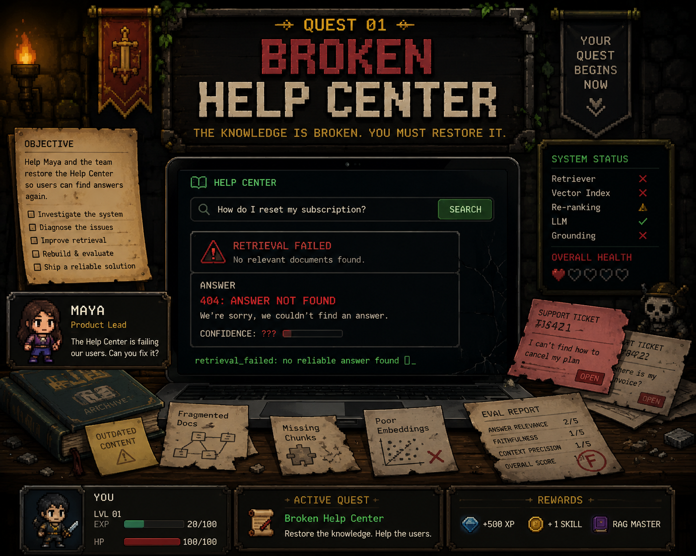

# BuildGuild: The Broken Help Center



```text
╔══════════════════════════════════════════════════════════════╗
║✦        .          *        ✧          .          ✦          ║
║        SYS: MEMORY FAULT     IDX: ? ? ?                      ║
║    /\/\        [404] HELP CENTER        /\/\                 ║
║ ~~~~~~~~~       corrupted index       ~~~~~~~~~              ║
║        ⚠ retrieval signal unstable ⚠                         ║
║                                                              ║
║      ██████╗ ██╗   ██╗██╗██╗     ██████╗                     ║
║      ██╔══██╗██║   ██║██║██║     ██╔══██╗                    ║
║      ██████╔╝██║   ██║██║██║     ██║  ██║                    ║
║      ██╔══██╗██║   ██║██║██║     ██║  ██║                    ║
║      ██████╔╝╚██████╔╝██║███████╗██████╔╝                    ║
║      ╚═════╝  ╚═════╝ ╚═╝╚══════╝╚═════╝                     ║
║                                                              ║
║                  B U I L D   G U I L D                       ║
║                                                              ║
║      ╔════════════════════════════════════════════╗          ║
║      ║QUEST I: THE BROKEN HELP CENTER             ║          ║
║      ║                                            ║          ║
║      ║The support bot has lost its memory.        ║          ║
║      ║The docs are noisy. Retrieval is cursed.    ║          ║
║      ║                                            ║          ║
║      ║Objective: Measure the baseline retriever.  ║          ║
║      ╚════════════════════════════════════════════╝          ║
║                                                              ║
║      > run start                                             ║
║      > choose name + difficulty                              ║
║      > mentor: Maya waits beyond setup_                      ║
║                                                              ║
║      cache: cold     corpus: awake     ranker: ???           ║
║✧       .        ✦      NULL      ???       ✦        .        ║
╚══════════════════════════════════════════════════════════════╝
```

The help-center bot works. Probably.

Nobody knows whether it finds the right articles, where it fails, or whether the team should trust it. Your quest is to turn the cursed vibes into a measurable baseline.

No fancy agents. No dashboards. No optimization yet. First, prove what the current retriever can and cannot do.

## Start

Open this repo in your favorite coding agent: Codex, Claude Code, or OpenCode.

Ask your coding agent:

```text
Start the BuildGuild game.
```

The game will ask your name and guidance level:

- `easy`: Apprentice mode with hints and check-ins.
- `medium`: Builder mode with fewer hints.
- `hard`: Expert mode with minimal spoon-feeding and distracting noise.

## Play

Along the way you will meet Maya, a product manager with sharp product instincts but shaky data intuition, and Ari, your builder buddy for turning messy evidence into a plan.

Talk to the characters, inspect the data, build the baseline, and bring the report back for review.

Your quest artifacts live in `analysis/`.

## Win Condition

You win by producing a baseline report with metrics, positive examples, and failed examples that make the broken help center understandable.

Quest 2 is not available yet. Star this repo to get an update when the next quest opens.
